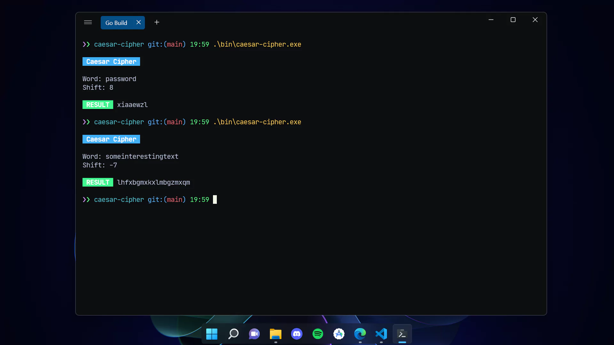

<h1> Caesar Cipher</h1>

Simple Go implementation of a Caesar Cipher Algorithm.

The Caesar Cipher is a fundamental cryptographic technique in which letters within a word undergo precise shifts forward or backward by a specified amount, resulting in the creation of a new word with altered letter positions. It proves particularly valuable for safeguarding uncomplicated passwords.

## Example

Say, we decide to cipher the word "password" forward by eight shifts, we'd have:  
-  Original: `p` `a` `s` `s` `w` `o` `r` `d` 
- Shifted (by 8): `x` `i` `a` `a` `e` `w` `z` `l`
